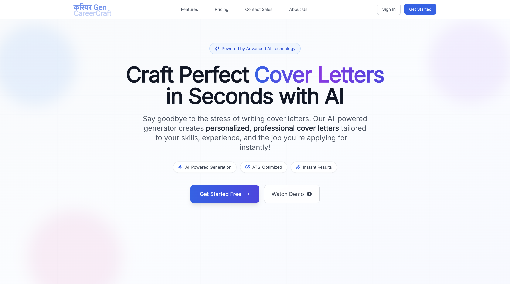

# CareerCraft 🚀

**Craft perfect cover letters in seconds with AI. Personalized, professional cover letters tailored to your skills and job applications—instantly!**

## Application View:


## Application Demo: [YouTube](https://www.youtube.com/watch?v=gdEQpJEM6dc)


## ✨ Features

- 🤖 **AI-Powered Generation**: Create personalized cover letters using advanced AI
- 🎨 **Modern UI/UX**: Clean, professional, and responsive design
- 📱 **Mobile-First**: Optimized for all devices and screen sizes
- 🔐 **Secure Authentication**: Google OAuth integration with NextAuth.js
- 📄 **PDF Export**: Download your cover letters as professional PDFs
- 🎯 **Smart Personalization**: Tailored content based on your profile and target role
- ⚡ **Real-time Generation**: Instant cover letter creation

## 🚀 Tech Stack

[](https://nextjs.org/)
[](https://www.typescriptlang.org/)
[](https://tailwindcss.com/)
[](https://next-auth.js.org/)

- **Frontend**: Next.js 14, TypeScript, Tailwind CSS
- **Authentication**: NextAuth.js with Google OAuth
- **Database**: Prisma with PostgreSQL
- **UI Components**: Custom components with Lucide React icons
- **Styling**: Tailwind CSS with custom animations
- **PDF Generation**: Browser print API with custom styling
- **Deployment**: Vercel-ready

## ️ Getting Started

### Prerequisites

- Node.js 18+ 
- npm, yarn, pnpm, or bun
- PostgreSQL database (for production)

### Installation

1. **Clone the repository**
   ```bash
   git clone https://github.com/Debjyoti2004/CareerCraft.git
   cd CareerCraft
   ```

2. **Install dependencies**
   ```bash
   npm install
   ```

3. **Set up environment variables**
   ```bash
   cp .env.example .env
   ```
   
   Add your environment variables:
   ```env
   NEXTAUTH_URL=http://localhost:3000
   NEXTAUTH_SECRET=your-secret-key
   GOOGLE_CLIENT_ID=your-google-client-id
   GOOGLE_CLIENT_SECRET=your-google-client-secret
   DATABASE_URL=your-database-url
   ```

4. **Set up the database**
   ```bash
   npx prisma generate
   npx prisma db push
   ```

5. **Run the development server**
   ```bash
   npm run dev
   # or
   yarn dev
   # or
   pnpm dev
   ```

6. **Open your browser**
   Navigate to [http://localhost:3000](http://localhost:3000)

## 📱 How It Works

1. **Sign In**: Authenticate with Google for secure access
2. **Personal Info**: Enter your basic details (name, age)
3. **Skills & Experience**: Add your technical skills and work experience
4. **Education**: Provide your educational background
5. **Target Role**: Specify the job you're applying for
6. **Generate**: AI creates a personalized cover letter
7. **Download**: Export as PDF or print directly

##  Design Features

- **Modern Glassmorphism**: Subtle backdrop blur effects
- **Gradient Accents**: Professional color schemes
- **Smooth Animations**: Framer Motion for delightful interactions
- **Responsive Grid**: Adaptive layouts for all screen sizes
- **Professional Typography**: Clean, readable fonts
- **Interactive Elements**: Hover effects and micro-interactions

<details>
<summary>Dummy data for CareerCraft</summary>

```json
{
  "age": 28,
  "skills": ["JavaScript", "React", "Node.js", "TypeScript"],
  "experience": [
    {
      "company": "Tech Corp",
      "role": "Frontend Developer",
      "duration": "2 years",
      "description": "Developed responsive web applications using React"
    }
  ],
  "education": {
    "degree": "Bachelor of Computer Science",
    "institution": "University of Technology",
    "year": "2020"
  },
  "targetRole": "Senior Frontend Developer",
  "targetCompany": "Dream Tech Inc"
}
```

</details>

